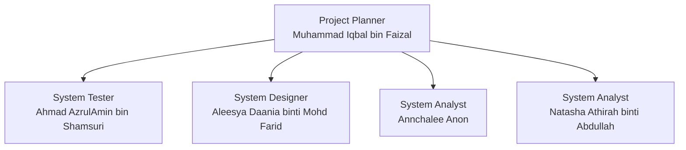
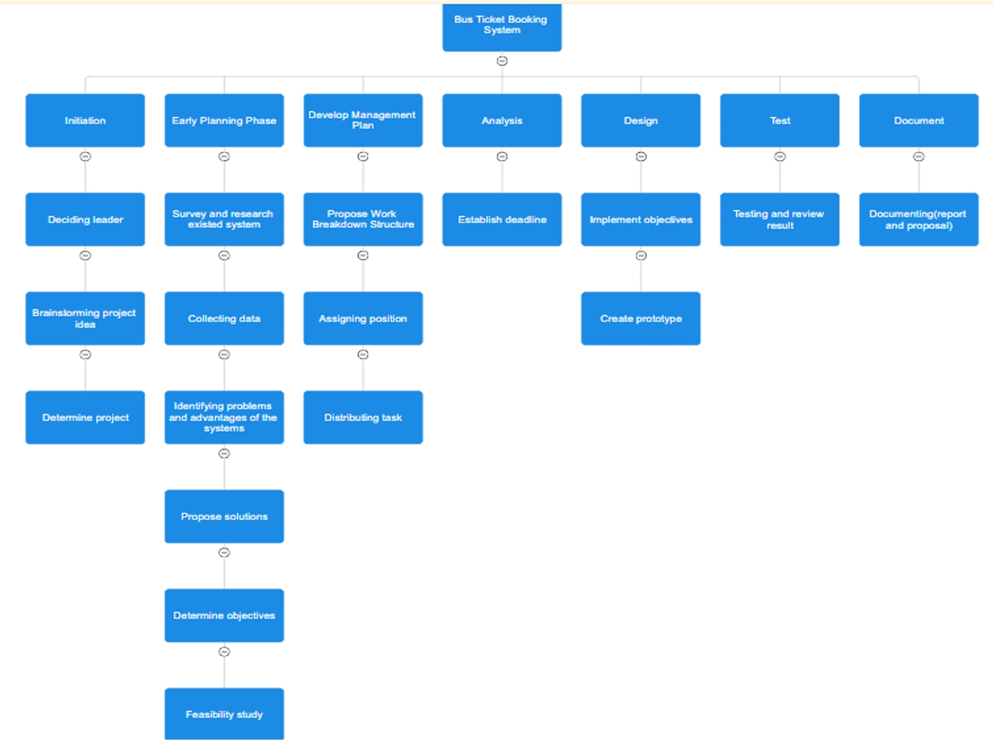
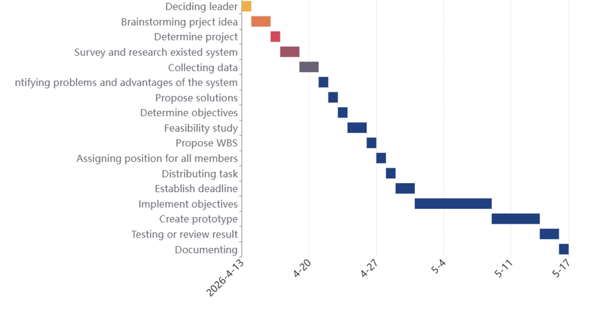
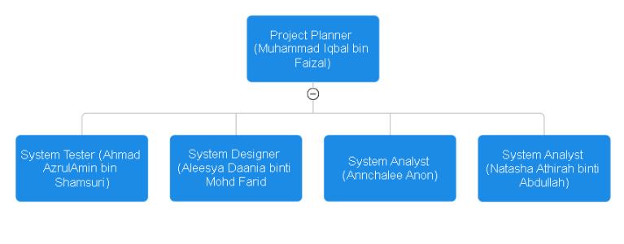
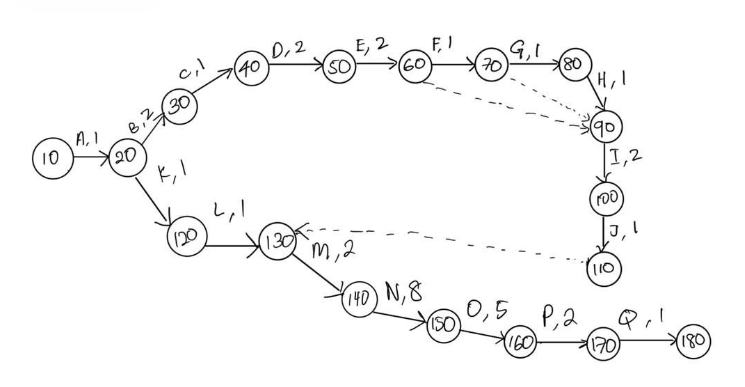

# Group1_Project1_SAD_20252026
# Universiti Teknologi Malaysia (UTM)
**Faculty of Computing – Johor Bahru**  
Course: System Analysis and Design (SECD2613)  
Section: 05  
Lecturer: Pn. Nor Anita Fairos Binti Ismail  

---

# Project Proposal  
## Bus Ticket Booking System

### Group Members
| Name | Matrics Number |
|------|----------------|
| Aleesya Daania binti Mohd Farid | A25CS0043 |
| Annchalee Anon | A25CS0194 |
| Natasha Athirah binti Abdullah | A25CS0289 |
| Muhammad Iqbal bin Faizal | A25CS0277 |
| Ahmad AzrulAmin bin Shamsuri | A25CS0175 |

---

## Table of Contents
1. Introduction  
2. Background Study  
3. Problem Statement  
4. Proposed Solutions  
   - 4.1 Feasibility Study  
5. Objectives  
6. Scope of the Project  
7. Project Planning  
   - 7.1 Human Resource  
   - 7.2 Work Breakdown Structure (WBS)  
   - 7.3 PERT Chart  
   - 7.4 Gantt Chart  
8. Benefit and Overall Summary of Proposed System  

---

## 1.0 Introduction
The Bus Ticketing Booking System is developed to facilitate bus ticket booking in a more efficient and systematic way. Users can check bus schedules, select seats, and make bookings online.  
The purpose is to replace the manual booking system with a computerized one that is faster, more accurate, and user‑friendly. Both customers and bus operators benefit from improved service quality and better data management.

---

## 2.0 Background Study
Bus services are widely used for commuting and long‑distance travel, but many booking processes remain manual.  
This causes inconvenience such as long waiting times and limited access to schedules and seat availability. Operators also struggle with managing records efficiently.  
With technology advancement, an online booking system modernizes the process, providing a digital platform for easier and faster ticket booking.

---

## 3.0 Problem Statement
Weaknesses of the current system include:  
- Customers must be physically present at counters → time‑consuming and inconvenient.  
- No real‑time updates on seat availability and schedules.  
- Manual record‑keeping leads to human errors (incorrect entries, lost records, double bookings).  

A more efficient and reliable system is needed.

---

## 4.0 Proposed Solutions

### 4.1 Feasibility Study
**a. Technical Feasibility**  
- Web‑based application accessible via smartphones, laptops, desktops.  
- Hosted on cloud/local server; users need only internet‑enabled devices.  
- Team has sufficient programming knowledge for core features.  
- Challenges: real‑time seat availability, booking conflicts → solvable with proper design.

**b. Operational Feasibility**  
- Addresses weaknesses of manual system.  
- Online booking anytime, anywhere.  
- Real‑time updates improve decision‑making and satisfaction.  
- Reduces workload and human errors for operators.  
- User‑friendly design → minimal training required.

**c. Economic Feasibility (Cost‑Benefit Analysis)**  
- Costs relatively low compared to benefits.  

**Estimated Costs**  
- Labour: RM10,500  
- Software: RM5,500  
- Maintenance: RM3,500  
- Utilities: RM2,500  

**Estimated Benefits**  
- Reduced manpower cost: RM18,000  
- Increased ticket sales: RM9,600  

**Assumptions**  
- Discount rate: 10%  
- Sensitivity factor (costs): 50%  
- Sensitivity factor (benefits): 70%  
- Annual increment (costs): 5%  
- Annual increment (benefits): 15%  

## Cost–Benefit Analysis

### Estimated Costs
| Item | Amount (RM) |
|------|--------------|
| Labour | 10,500 |
| Software | 5,500 |
| Maintenance | 3,500 |
| Utilities | 2,500 |

### Estimated Benefits
| Item | Amount (RM) |
|------|--------------|
| Reduced manpower cost | 18,000 |
| Increased ticket sales | 9,600 |

### Assumptions
| Parameter | Value |
|------------|--------|
| Discount rate | 10% |
| Sensitivity factor (costs) | 50% |
| Sensitivity factor (benefits) | 70% |
| Annual increment (costs) | 5% |
| Annual increment (benefits) | 15% |

### Yearly Breakdown
| Criteria | Year 0 | Year 1 | Year 2 | Year 3 |
|-----------|--------|--------|--------|--------|
| ***1. Cost***|
| ***A. DEVELOPMENT*** |
|  | 10500 | - | - | - |
|  | 5500 | - | - | - |
| **Development Cost** | **16,000** | - | - | - |
| ***B. OPERATION*** |
|  | - | 9000 | 9450 | 9922 |
|  | - | 4800 | 5040 | 5292 |
| **Total Operation Cost** | - | 13,800 | 14,490 | 15,214 |
| **Present Value (Cost)** | - | 12,545 | 11,975 | 11,430 |
| **Accumulated Cost** | - | **28,548** | **40,520** | **51,950** |
| ***2. BENEFITS*** |
| | - | 12600 | 14490 | 16663 |
| | - | 6720 | 7728 | 8887 |
| **Total Benefit (Annual)** | - | **19,320** | **22,218** | **25,550** |
| | | | |
| **Present Value (PV)** | - | 17,563 | 18,361 | 19,196 |
| **Accumulated Benefit** | **17,563** | **35,924** | **55,050** | - |
| **Gain/Loss** | - | -10,985 | -4,595 | 29,500 |
| **Profitability Index (PI)** | **1.8** | | | |

---

## 5.0 Objectives
1. Develop a system for easy online bus ticket booking.  
2. Provide accurate, real‑time schedules and seat availability.  
3. Reduce human errors in booking.  
4. Improve convenience with anytime, anywhere booking.  
5. Manage booking data systematically.

---

## 6.0 Scope of the Project
- Cross‑platform access with a user‑friendly interface.  
- All devices access a single database → errors corrected immediately.  
- Requires only necessary information, with real‑time feedback on schedules and seats.

---

## 7.0 Project Planning

### 7.1 Human Resource

## Project Management Charts

### Work Breakdown Structure

### Project Planning Schedule

| Activity | Description                                | Predecessor | Estimated Time (Days) |
|----------|--------------------------------------------|-------------|-----------------------|
| A        | Deciding Leader                            | None        | 1                     |
| B        | Brainstorming project idea                 | A           | 2                     |
| C        | Determine project                          | B           | 1                     |
| D        | Survey and research existed system         | C           | 2                     |
| E        | Collecting data (Google Form, interview)   | D           | 2                     |
| F        | Identifying problems and advantages        | E           | 1                     |
| G        | Propose solutions                          | F           | 1                     |
| H        | Determine objectives                       | G, F        | 1                     |
| I        | Feasibility study (financial, technical)   | H           | 2                     |
| J        | Propose Work Breakdown Structure           | I           | 1                     |
| K        | Assigning position for all members         | A           | 1                     |
| L        | Distributing task                          | K           | 1                     |
| M        | Establish deadline (Gantt chart, PERT)     | J, K, L     | 2                     |
| N        | Implementing objectives                    | M           | 8                     |
| O        | Create prototype                           | N           | 5                     |

### Gantt Chart

### Organizational Chart

### PERT Chart

### PERT Chart Path Analysis

**Path 1:** A‑B‑C‑D‑E‑F‑I‑M‑N‑O‑P‑Q  
**Length:** 1 + 2 + 1 + 2 + 2 + 1 + 2 + 1 + 2 + 8 + 5 + 2 + 1 = **30 days**

**Path 2:** A‑B‑C‑D‑E‑F‑G‑H‑I‑J‑M‑N‑O‑P‑Q  
**Length:** 1 + 2 + 1 + 2 + 2 + 1 + 1 + 1 + 2 + 1 + 2 + 8 + 5 + 2 + 1 = **32 days**

**Path 3:** A‑B‑C‑D‑E‑F‑G‑I‑J‑M‑N‑O‑P‑Q  
**Length:** 1 + 2 + 1 + 2 + 2 + 1 + 1 + 2 + 1 + 2 + 8 + 5 + 2 + 1 = **31 days**

**Path 4:** A‑K‑L‑M‑N‑O‑P‑Q  
**Length:** 1 + 1 + 1 + 2 + 8 + 5 + 2 + 1 = **21 days**

---

**Critical Path:**  
The longest path in the PERT diagram is **Path 2**, therefore **Path 2 is the critical path**.

 ## 8.0 BENEFIT AND OVERALL SUMMARY OF PROPOSED SYSTEM 
The benefit of the proposed system is an automated, user-driven system that allows 
users to manage bus ticket bookings efficiently given that they have an internet-enabled 
device. It saves time and energy alongside improving accessibility by utilising modern 
technology.  
In conclusion, this system will improve the overall quality-of-life for frequent bus users 
by increasing accessibility and efficiency for booking tickets. The highlighted features 
for this proposed system will be real-time information regarding bus schedules and seat 
availability, allowing flexibility in bookings. Lastly, a user-friendly UI which is easy to 
understand and use by anyone, anywhere. 

